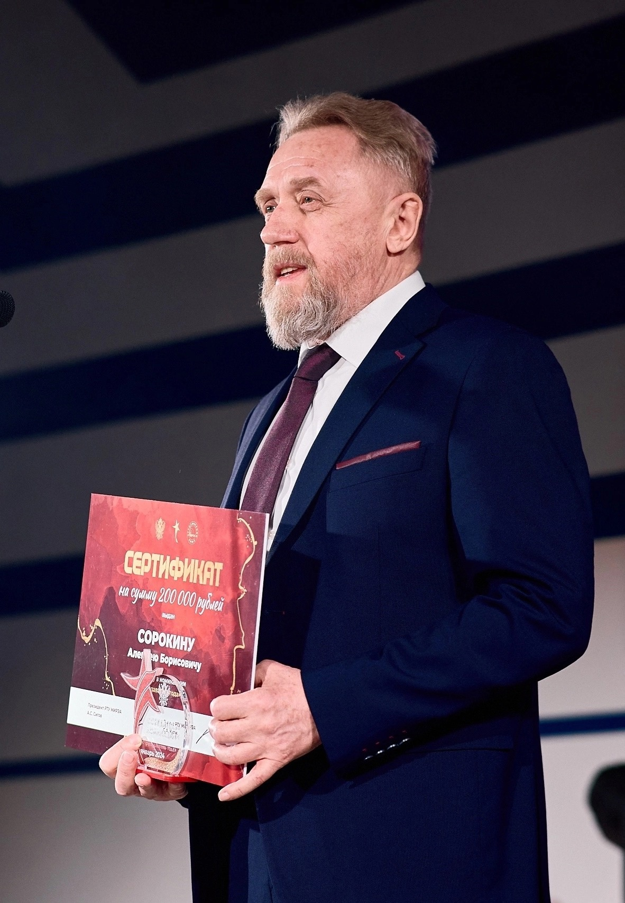
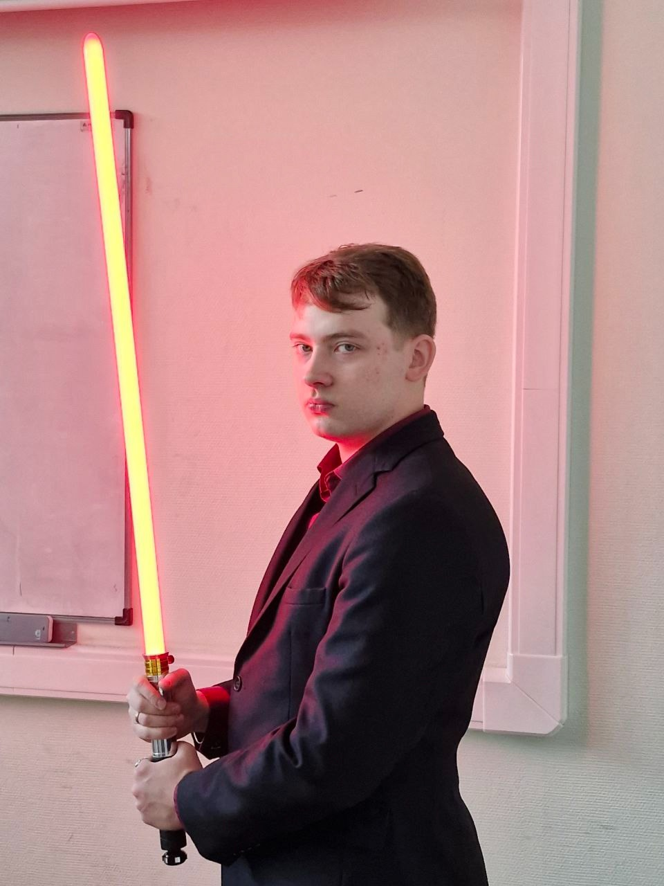

# Информация о дисциплине

Репозиторий представляет материалы по дисциплине ***Проектирование интеллектуальных систем, часть первая***, прочитанной в ****2025** году кафедрой ***Вычислительной техники (ВТ)*****.

Курс лекций провёл
***Сорокин Алексей Борисович***,
кандидат технических наук, доцент кафедры вычислительной техники,
лауреат звания «Преподаватель года».

  
   
  <strong>Рисунок 1 - Сорокин Алексей Борисович</strong>

Практические занятия курса провёл
***Холмогоров Владислав Владиславович***,
практикующий специалист в области машинного обучения и нейронных сетей.

  
   
  <strong>Рисунок 2 - Холмогоров Владислав Владиславович</strong>

В папке ***Лекции*** находятся pdf-файлы лекций курса. Для каждой практической работы создана отдельная папка. Отчеты по практическим работам доступны в форматах ***.docs*** и ***.pdf***.

# Практическая часть

???.

## Практическая работа №1

???.

## Практическая работа №2

???..

## Практическая работа №3

???..

## Практическая работа №4

???..

## Практическая работа №5

???..

## Практическая работа №6

???..

## Практическая работа №7

???..